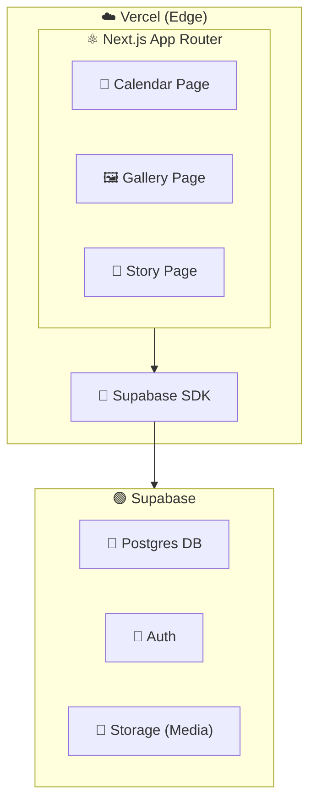
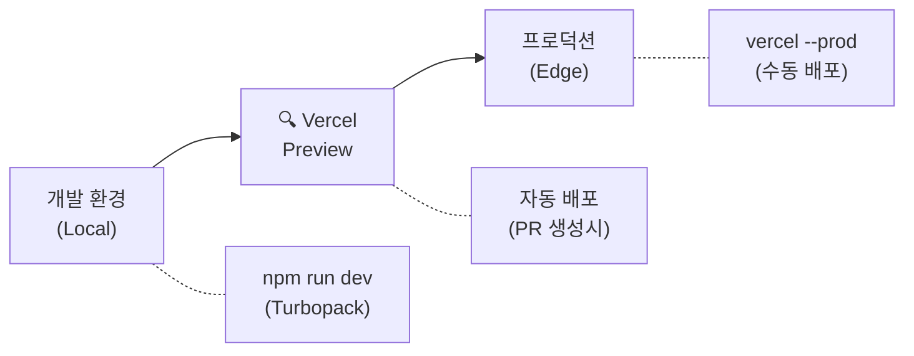
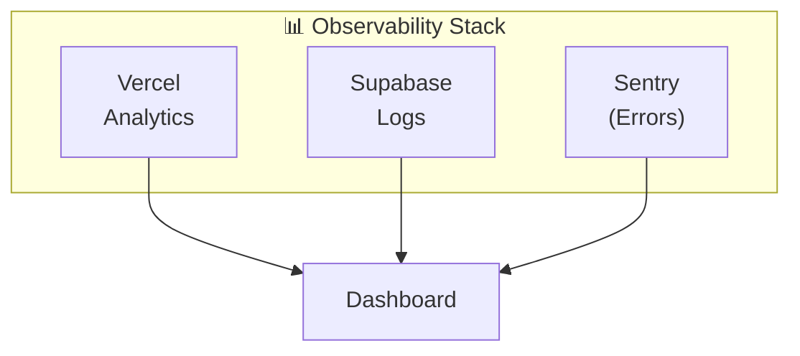

# 🗓️ Family Calendar - 프로젝트 기술 분석

---
[[필수 지식]]
# 1. 기획 & 비즈니스

### 1.1 MVP (Minimum Viable Product)
가족 캘린더의 MVP 핵심 기능

| 기능  | MVP 범위     |
| --- | ---------- |
| 캘린더 | 일정 CRUD    |
| 앨범  | 사진 업로드     |
| 스토리 | 24시간 임시 공유 |
| 인증  | 가족 코드 기반   |

**첫  MVP 단계에서는 핵심 기능 위주로만 구성함. 
반응/댓글 기능이나 슬라이드쇼 이런 기능도 생각했었는데 , 제쳐두고 일단 이정도만 구성해봄.

### 1.2 PMF (Product-Market Fit)
- pain point : 가족 간 교류 부족 , 생일 까먹고 안챙겼다가 혼남 , 여행 사진이 휴대폰 속에만 있고 , 공유가 안됨.
- Solution : 캘린더 기능 , 앨범(전시관) , 스토리 기능이 통합된 가족 전용 플랫폼 
- Target : 아빠 , 엄마 , 형 , 나


### 보완점
- 정량적 지표 설정 : '가족 간 교류 증진' 이런 추상적인 목표 대신 '주당 평균 사진 업로드 수' , '일정 등록 대비 확인율' 같은 구체적인 지표 설정
- 사용자 입장에서 생각 : 가족 구성원들이 어떻게 이 앱을 사용할지 머릿속으로 시나리오 그려보기
- 확장성 고려 : 지금은 가족 구성원 4명밖에 없지만 , 사용자가 1000명,10000명 이상 넘어갈 때 가족코드 인증방식이 적절할지 , 데이터베이스는 어떻게 관리해야할지 고려해보기


---

# 2. 설계 및 아키텍처

### 2.1 시스템 아키텍처

Vercel + Next.js + Supabase 기반의 풀스택 애플리케이션 구조

---

## 아키텍처 다이어그램


---

##  레이어 구조

### 1. 프론트엔드 (Vercel Edge)
| 구성요소               | 설명                 |
| ------------------ | ------------------ |
| Vercel             | Edge 배포 및 호스팅      |
| Next.js App Router | React 기반 풀스택 프레임워크 |

### 2. 페이지 구성
| 페이지           | 기능          |
| ------------- | ----------- |
| Calendar Page | 캘린더/일정 관리   |
| Gallery Page  | 갤러리/이미지 뷰어  |
| Story Page    | 스토리/콘텐츠 페이지 |

### 3. 백엔드 (Supabase)
| 서비스         | 용도         |
| ----------- | ---------- |
| Postgres DB | 관계형 데이터베이스 |
| Auth        | 사용자 인증     |
| Storage     | 미디어 파일 저장  |

별도의 서버 구축 없이 기능들을 SDK를 통해 직접 연동

---

## 데이터 흐름
```
사용자 요청
    ↓
Vercel (Edge Network)
    ↓
Next.js App Router (SSR/CSR)
    ↓
Supabase SDK
    ↓
Supabase Backend
├── Postgres DB (데이터 CRUD)
├── Auth (인증/권한)
└── Storage (파일 업로드/다운로드)
```

---

### 2.2 렌더링 전략 (SSR vs CSR)

| 페이지      | 렌더링 방식           | 이유               |
| -------- | ---------------- | ---------------- |
| Layout   | Server Component | 정적 구조, JS 번들 최소화 |
| Calendar | Client Component | 인터랙티브한 날짜 선택     |
| Gallery  | Client Component | 무한 스크롤, 실시간 업로드  |
| Story    | Client Component | 애니메이션, 실시간 상태    |

- Next.js App Router의 성능을 극대화 하기 위해 가능하면 최대한 Server-first 철학을 지키고자 하였다. 
- 컴포넌트를 여러개로 쪼개서 상위 구조를 Server Component로 유지하고 , 사용자와 상호작용해야하는 부분들만 Client Component로 구성하였다.


**'use client' 지시어 사용 기준:**
```typescript
// Client Component가 필요한 경우
'use client';

import { useState, useEffect } from 'react'; // React hooks
import { motion } from 'framer-motion';       // 애니메이션
import { useAuthStore } from '@/stores';      // 클라이언트 상태
```


### 2.3  폴더 구조

> 도메인 단위 응집도 기반 구조

---

##  전체 구조
```
src/
├── app/                      # App Router (라우팅)
├── components/               # UI 컴포넌트
├── lib/                      # 유틸리티, SDK 설정
└── stores/                   # 클라이언트 상태 (Zustand)
```

---

- app/ (라우팅)
```
app/
├── (main)/
│   ├── calendar/
│   ├── gallery/
│   ├── story/               
│   ├── settings/
└── layout.tsx
```

| 경로           | 설명                |
| ------------ | ----------------- |
| `(main)/`    | 라우트 그룹 (URL에 미포함) |
| `calendar/`  | 캘린더 페이지           |
| `gallery/`   | 갤러리 페이지           |
| `story/`     | 스토리 페이지           |
| `settings/`  | 설정 페이지            |
| `layout.tsx` | 공유 레이아웃 컴포넌트      |

---

- components/ (UI 컴포넌트)
```
components/
├── layout/                  # 네비게이션, 레이아웃
│   ├── Navbar.tsx
│   ├── BottomNav.tsx
│   └── index.ts             # Barrel export
├── gallery/
├── stories/                 # 스토리 관련 컴포넌트
│   ├── StoryCircle.tsx
│   ├── StoryViewer.tsx
│   └── StoryUpload.tsx
└── auth/
```

| 폴더         | 컴포넌트              | 역할             |
| ---------- | ----------------- | -------------- |
| `layout/`  | `Navbar.tsx`      | 상단 네비게이션       |
|            | `BottomNav.tsx`   | 하단 네비게이션 (모바일) |
|            | `index.ts`        | Barrel export  |
| `stories/` | `StoryCircle.tsx` | 스토리 썸네일 원형 UI  |
|            | `StoryViewer.tsx` | 스토리 전체화면 뷰어    |
|            | `StoryUpload.tsx` | 스토리 업로드 모달     |
| `gallery/` | -                 | 갤러리 관련 컴포넌트    |
| `auth/`    | -                 | 인증 관련 컴포넌트     |

---

- lib/ (유틸리티)
```
lib/
└── supabase/
    └── client.ts
```

| 파일 | 용도 |
|------|------|
| `supabase/client.ts` | Supabase 클라이언트 초기화 |

---

- stores/ (상태 관리)
```
stores/
└── authStore.ts
```

| 파일 | 용도 |
|------|------|
| `authStore.ts` | 인증 상태 (family, profile) |

---

- 설계 원칙

| 원칙                | 설명                        |
| ----------------- | ------------------------- |
| **도메인 응집**        | 관련 파일을 기능별로 그룹화           |
| **Barrel Export** | `index.ts`로 깔끔한 import 경로 |
| **Colocation**    | 라우트와 컴포넌트 근접 배치           |
| **관심사 분리**        | UI / 로직 / 상태 명확히 분리       |

### 추가 보완할 점
1. FSD(Feature-Sliced Design) 아키텍쳐 : features , entities , shared등 레이어 별로 엄격히 나누어 의존성 방지하는 방법 공부해보기
2. API 계층 분리 : 컴포넌트에서 직접 Supbase SDK 호출하는 대신 , 중간 서비스 레이어를 거치게 해서 백엔드 기술이 바뀌더라도 UI 코드를 수정할 필요가 없게끔 설계


---


# 3. 개발 및 엔지니어링

### 3.1 핵심 기술 스택

| 패키지             | 용도                    |
| --------------- | --------------------- |
| `Next.js`       | App Router, Turbopack |
| `Supbase SDK`   | 백엔드 연동                |
| `framer-motion` | 애니메이션                 |
| `zustand`       | 클라이언트 상태 관리           |
| `date-fns`      | 날짜 처리                 |
| `tailwindcss`   | 스타일링                  |
### 학습 point
1. Next.js
   - Streaming SSR 과 Partial Prerendering 개념을 통해 사용자 체감 속도  높일 수 있는 방법 탐구
2. Zustand
   - Selector 기반 업데이트 : 상태 전체를 가져오는 대신 필요한 값만 선택해서 렌더링 성능 최적화 방법 탐구
 3. Supbase
 - DB 스키마로부터 TypeScript 타입을 자동으로 생성하여 런타입 에러 0으로 줄이는 방법 탐구 


---

### 3.2 데이터베이스 스키마

### Stories 테이블
```sql
CREATE TABLE stories (
  id UUID PRIMARY KEY DEFAULT gen_random_uuid(),
  family_id UUID REFERENCES families(id) ON DELETE CASCADE,
  profile_id UUID REFERENCES profiles(id) ON DELETE CASCADE,
  media_url TEXT NOT NULL,
  media_type TEXT CHECK (media_type IN ('image', 'video')),
  caption TEXT,
  created_at TIMESTAMPTZ DEFAULT NOW(),
  expires_at TIMESTAMPTZ DEFAULT (NOW() + INTERVAL '24 hours')
);
```

### Story Views 테이블
```sql
CREATE TABLE story_views (
  id UUID PRIMARY KEY DEFAULT gen_random_uuid(),
  story_id UUID REFERENCES stories(id) ON DELETE CASCADE,
  profile_id UUID REFERENCES profiles(id) ON DELETE CASCADE,
  viewed_at TIMESTAMPTZ DEFAULT NOW(),
  UNIQUE(story_id, profile_id)
);
```

### RLS 정책
```sql
ALTER TABLE stories ENABLE ROW LEVEL SECURITY;

CREATE POLICY "가족 구성원만 스토리 조회 가능"
  ON stories FOR SELECT
  USING (
    family_id IN (
      SELECT family_id FROM profiles 
      WHERE id = auth.uid()
    )
  );
```

---

### 3.3 핵심 코드 패턴

### (1) 데이터 패칭 (useCallback + useEffect)
```typescript
const fetchData = useCallback(async () => {
  if (!family?.id || !profile?.id) {
    setIsLoading(false);
    return;
  }

  setIsLoading(true);
  try {
    const supabase = createClient();
    
    const { data, error } = await supabase
      .from('stories')
      .select('*')
      .eq('family_id', family.id)
      .gt('expires_at', new Date().toISOString())
      .order('created_at', { ascending: false });

    if (!error && data) setStories(data);
  } catch (err) {
    console.error('Failed to fetch:', err);
  } finally {
    setIsLoading(false);
  }
}, [family?.id, profile?.id]);

useEffect(() => {
  fetchData();
}, [fetchData]);
```

### (2) 상태 관리 (Zustand)
```typescript
// stores/authStore.ts
import { create } from 'zustand';

interface AuthState {
  family: Family | null;
  profile: Profile | null;
  setFamily: (family: Family) => void;
  setProfile: (profile: Profile) => void;
}

export const useAuthStore = create<AuthState>((set) => ({
  family: null,
  profile: null,
  setFamily: (family) => set({ family }),
  setProfile: (profile) => set({ profile }),
}));
```

### (3) 컴포넌트 구조
```typescript
// 순서: 인터페이스 → 컴포넌트 → 헬퍼 함수

interface Story {
  id: string;
  profile_id: string;
  media_url: string;
  media_type: 'image' | 'video';
  caption?: string | null;
  created_at: string;
  expires_at: string;
}

export default function StoryPage() {
  // 1️⃣ 상태 선언
  const { family, profile } = useAuthStore();
  const [stories, setStories] = useState<Story[]>([]);
  
  // 2️⃣ 데이터 패칭
  const fetchData = useCallback(async () => { /* ... */ }, []);
  
  // 3️⃣ 파생 상태 계산
  const getStoriesByProfile = useCallback(() => {
    const grouped = new Map<string, Story[]>();
    stories.forEach(story => {
      if (!grouped.has(story.profile_id)) {
        grouped.set(story.profile_id, []);
      }
      grouped.get(story.profile_id)!.push(story);
    });
    return grouped;
  }, [stories]);
  
  // 4️⃣ 이벤트 핸들러
  const openStoryViewer = (profile: Profile) => { /* ... */ };
  
  // 5️⃣ 렌더링
  return ( /* JSX */ );
}
```

---

### 3.4 애니메이션 패턴 (Framer Motion)

### 레이아웃 애니메이션
```tsx
<motion.div
  layoutId="activeTabMobile"
  className="absolute inset-0 rounded-xl bg-gradient-to-r from-purple-500 to-pink-500"
  transition={{ type: 'spring', stiffness: 400, damping: 30 }}
/>
```

### 진입/퇴장 애니메이션
```tsx
<AnimatePresence>
  {isOpen && (
    <motion.div
      initial={{ opacity: 0, y: 20 }}
      animate={{ opacity: 1, y: 0 }}
      exit={{ opacity: 0, y: 20 }}
    >
      {/* content */}
    </motion.div>
  )}
</AnimatePresence>
```

### 제스처 애니메이션
```tsx
<motion.button
  whileTap={{ scale: 0.9 }}
  whileHover={{ scale: 1.02 }}
>
  Click me
</motion.button>
```

---

### 3.5 CI/CD 파이프라인


### 개선점
자동화된 테스트 파이프라인 추가 
-  단순히 배포만 하는 식으로 되어있는데 , PR 생성 시 Linting(코드 스타일 체크), Type Check(타입 오류 검사) , Unit Tes가 자동으로 실행되도록 최적화하는 구조 설계  

### 배포 명령어

| 환경 | 명령어 | 설명 |
|------|--------|------|
| 개발 | `npm run dev` | Turbopack 사용 |
| 프리뷰 | PR 생성 | 자동 배포 |
| 프로덕션 | `vercel --prod` | 수동 배포 |

# 6. Observability (관측 가능성)

---

### 6.1 현재 구현

### 로깅 패턴
```typescript
// 로깅 패턴
try {
  // 작업 수행
} catch (err) {
  console.error('Failed to fetch data:', err);
  // TODO: 외부 로깅 서비스 연동
}
```

> [!warning] 현재 한계
> - `console.error`만 사용 중
> - 외부 로깅 서비스 미연동
> - 사용자 브라우저에서 발생생하는 런타임 에러 추적 불가

---

### 6.2 개선 계획

### Observability Stack


### 도구별 역할

| 도구                   | 역할      | 수집 데이터                |
| -------------------- | ------- | --------------------- |
| **Vercel Analytics** | 성능 모니터링 | Core Web Vitals, 페이지뷰 |
| **Supabase Logs**    | DB 로그   | 쿼리 로그, API 호출         |
| **Sentry**           | 에러 추적   | 런타임 에러, 스택 트레이스       |
| **Dashboard**        | 통합 뷰    | 전체 메트릭 시각화            |

---


## 7. 학습 정리

### 이번 프로젝트에서 배운 것

1. **Server-first 철학**: 가능한 서버에서 처리하고 클라이언트 JS 최소화
2. **MVP 사고방식**: 댓글/반응 제거 결정 = 핵심에 집중
3. **도메인 응집도**: 스토리 기능을 별도 경로로 분리하여 관리 용이성 확보
4. **RLS 보안**: 데이터베이스 레벨에서 접근 제어
5. **CI/CD**: Vercel을 통한 즉시 배포

🚀 프로덕션 URL: [https://family-calendar-zeta-three.vercel.app](https://family-calendar-zeta-three.vercel.app/)


## 📋 Family Calendar 개발 유용 프롬프트 모음

### 1. 프로젝트 시작 & 개발 프로세스

```
한번에 모든 것을 다 만들려고 하지 말고, 단계별로 개발해주고, 
중간중간 나에게 어떻게 개발할지 구체적으로 물어보며 작업해줘.
```

```
중간중간 나에게 보고하면서 나의 컨펌 받는식으로 진행하자.
```

```
현재 내가 해야 할 것들 알려줘
```

```
지금 어디까지 진행 되었고, 추가로 진행해야 할 부분은 어디야?
```

---

### 2. UI/UX 디자인 개선

**전체 디자인 개선:**

```
디자인을 좀 더 생동감 있고, 깔끔하고, 세련되게 수정해줘.
```

```
UI/UX를 깔끔하고, 정돈된 형태로 수정해줘.
```

**특정 분위기/컨셉 요청:**

```
첫 랜딩 페이지 화면을 전시관에 입장하는 듯한 압도감을 느낄 수 있도록 수정해줘
```

```
앨범 UI/UX 디자인을 전시관을 구경하는 듯한 느낌으로 압도당할 수 있게 하고싶어.
```

---

### 3. 모바일 최적화 (가장 자주 사용)

**일반적인 모바일 최적화:**

```
모바일 환경에서 실행했을 때, UI/UX의 크기 비율이 맞지 않는 문제가 발생해.
모든 UI/UX를 모바일 사용자 친화적이게 비율을 맞춰줘.
```

```
모바일 친화적으로 전체적인 UI/UX를 수정해줘.
```

**구체적인 디바이스 언급:**

```
전체적인 비율을 아이폰, 갤럭시 스마트폰에 맞게 크기를 조절해줘.
```

**레퍼런스 앱 참조:**

```
기존의 잘 알려진 캘린더 앱들을 참고해서
UI/UX를 모바일 사용자에게 최적화 될 수 있도록 수정해줘.
```

**터치 영역 개선:**

```
모바일에서 X버튼이 화면 끝에 있어서 누르기 불편해.
UX를 사용자 친화적으로 클릭하기 용이하게 수정해줘
```

---

### 4. 기능 추가/수정

**새 기능 추가:**

```
인스타 스토리처럼 앨범 옆에 스토리 카테고리를 만들어서 
가족 구성원들이 스토리로 일상을 공유할 수 있는 기능을 만들어줘.
인스타그램처럼 누가 확인했는지 확인할 수 있도록 표시해주고, 
24시간이 지나면 사라지도록 구성해줘.
```

**기존 기능 개선:**

```
동영상 파일도 업로드 할 수 있게 수정해줘
```

```
각 카테고리별로 사진 포토 슬라이드쇼 기능 별도로 추가해줘 (동영상은 제외)
```

**기능 정리/삭제:**

```
스토리 카테고리 영역에서 스토리 추가 버튼이 불필요하게 많아. 
하나만 남겨두고 깔끔하게 정리해줘.
```

```
좋아요, 댓글 기능은 없애는게 깔끔해서 없애줘.
```

---

### 5. 배포 관련

```
Vercel에 배포해.
```

```
배포까지 완료해줘
```

```
배포하면 수정하기 어려워? 수정 마무리 해놓고 배포하는게 좋을까?
```

---

### 6. 문제 해결 요청

**스크린샷과 함께:**

```
모바일에서 이렇게 되어 있어서 삭제와 x버튼을 누르기 불편해. 
전체적인 비율을 조정해서 UX부분을 개선해줘
[스크린샷 첨부]
```

**에러 발생 시:**

```
오류가 발생해서 이것부터 해결해야할 것 같아
[스크린샷 첨부]
```

---

### 7. 개선점 탐색

```
완벽한 캘린더 웹을 만드는게 목표인데, 더 수정할 부분이 있는지 찾아줘
```

```
가족 캘린더 + 앨범 서비스에서 또 필요한 부분이나 개선점은 뭐가 있을까?
```

---

### 8. 복합 수정 요청 (번호 리스트 형식)

```
수정사항
1. 캘린더 UI/UX에서 전체적으로 위로 구성되어있어서 모바일에서 상단의 버튼을 클릭하기 불편해.
2. 스토리에 사진을 첨부하고 업로드 할 수 있는 버튼이나 기능이 없어.
3. 앨범 카테고리 영역에서 모바일 스마트폰에서 사진을 업로드할 수 있는 기능이 없어.
```

---

### 9. 데이터베이스/백엔드

```
Supabase 마이그레이션 실행 어떻게 해야하는지 자세하게 알려줘
```

```
SQL Editor에 추가하고 Run 완료했어
```

---

### 10. 문서화 요청

```
이 pdf 속 내용을 기반으로
내가 지금까지 개발한 가족 캘린더의 기획, 개발 전 과정을 
개발하는 과정에서 사용된 기술적 메커니즘등 
옵시디언에 정리할 수 있게 마크다운 형식으로 정리해줘.
```